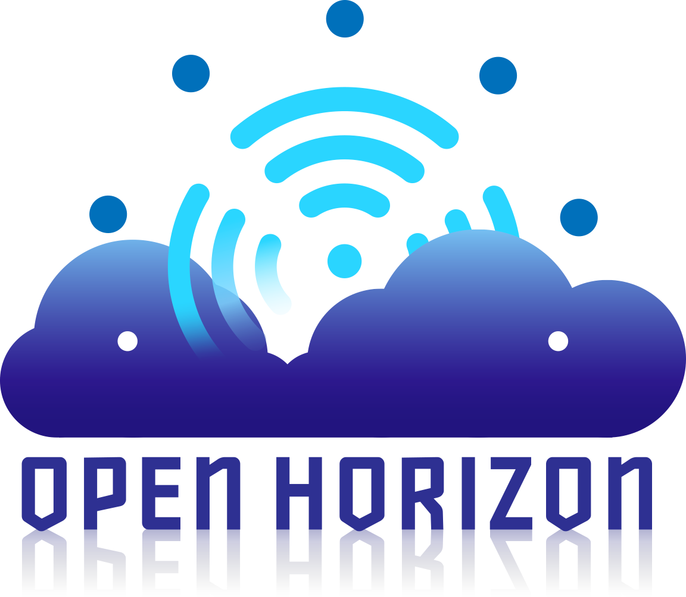

# Getting Started

## Documentation

**Open Horizon documentation repository coming soon!** For the time being, you can learn more about [Open Horizon here](https://www.ibm.com/support/knowledgecenter/SSFKVV_4.2/kc_welcome_containers.html).

## Management Hub Installation

Before you can publish and use any of the services in this repository, you must first deploy your own Horizon Management Hub. This can be done with one simple command using the `deploy-mgmt-hub.sh` script located in the [devops repository](https://github.com/open-horizon/devops/tree/master/mgmt-hub#horizon-management-hub). This will give you a management hub with several services, policies and patterns published in the exchange.

## Register an Edge Node with your Mangement Hub

In order to deploy a service to an edge node it must first be registered with a management hub. The `agent-install.sh` script is a fast and easy way to register an edge node with a management hub. More information can be found in the [open-horizon/anax](https://github.com/open-horizon/anax/tree/master/agent-install#edge-node-agent-install) repository. Edge nodes can be either a device or a cluster. Open Horizon edge cluster capability helps you manage and deploy workloads from a management hub cluster to remote instances of OpenShift® Container Platform or other Kubernetes-based clusters.

Typically, **edge devices** have a prescriptive purpose, provide (often limited) compute capabilities, and are located near or at the data source. Currently supported edge device OS and architectures:

* x86_64
  * Linux x86_64 devices or virtual machines that run Ubuntu 20.x (focal), Ubuntu 18.x (bionic), Debian 10 (buster), Debian 9 (stretch)
  * Red Hat Enterprise Linux® 8.x and 9.x
  * Fedora Workstation 32 - 37
  * CentOS 8.x
  * SuSE 15 SP2
* ppc64le (support starting Horizon version 2.28)
  * Red Hat Enterprise Linux® 7.9
* ARM (32-bit)
  * Linux on ARM (32-bit), for example Raspberry Pi, running Raspberry Pi OS buster or stretch
* ARM (64-bit)
  * Linux on ARM (64-bit), for example NVIDIA Jetson Nano, TX1, or TX2, running Ubuntu 18.x (bionic) or Raspberry Pi OS 64bit
* Mac
  * macOS (Intel)

Open Horizon **edge cluster** capability helps you manage and deploy workloads from a management hub cluster to remote instances of OpenShift® Container Platform or other Kubernetes-based clusters. Edge clusters are edge nodes that are Kubernetes clusters. An edge cluster enables use cases at the edge, which require colocation of compute with business operations, or that require more scalability, availability, and compute capability than what can be supported by an edge device. Further, it is not uncommon for edge clusters to provide application services that are needed to support services running on edge devices due to their close proximity to edge devices. Open Horizon deploys edge services to an edge cluster, via a Kubernetes operator, enabling the same autonomous deployment mechanisms used with edge devices. The full power of Kubernetes as a container management platform is available for edge services that are deployed by Open Horizon. Currently supported edge cluster architectures:

* [OCP on x86_64 platforms](https://docs.openshift.com/container-platform/4.5/welcome/index.html)
* [K3s - Lightweight Kubernetes](https://rancher.com/docs/k3s/latest/en/)
* [MicroK8s](https://microk8s.io/docs) on Ubuntu 18.04 (for development and test, not recommended for production)

Currently there is only one example service in this repository that is designed to run on an edge cluster and that is the [nginx-operator](edge/services/nginx-operator).

# Example Services

During the management hub installation, several services should have been published into the exchange automatically. The following three command will list the services, patterns, and deployment policies available in your exchange:

```sh
hzn exchange service list IBM/
hzn exchange pattern list IBM/
hzn exchange deployment listpolicy
```

**Note:** The above commands assume you have the Horizon environment variables `HZN_ORG_ID` and `HZN_EXCHANGE_USER_AUTH` set.

You can find a list of available edge services in this repository located in the [edge/services](edge/services) directory. For the most part, each of the services are broken up into micro-services designed to accomplish one specific task. This makes them easier to incorporate into a wide variety of "top-level" services.

A good example of a "top-level" service is [cpu2evtstreams](edge/evtstreams/cpu2evtstreams), which has two dependent services ([cpu_percent](edge/services/cpu_percent), and [gps](edge/services/gps)). It uses these two micro-services to gather information about the edge node it is running on and sends it to an instance of IBM Event Streams using `kafkacat`.

Edge examples specific to the Watson IoT Platform are found in [edge/wiotp](edge/wiotp). These examples are not being maintained.

The backend infrastructure for the `sdr2evtstreams` service has been deprecated and removed from this repo. If you wish to access the most recent version, you can find it in the [deprecated_cloud_sdr_example](https://github.com/open-horizon/examples/tree/deprecated_cloud_sdr_example) branch or any open-horizon/examples release v2.30.0-934 or older.

# Using Example Services

Each example service in this repo has a [README](edge/services/helloworld/README.md#horizon-hello-world-example-edge-service) that includes steps to run it when it is currently published in your exchange, or a ["Create your own"](edge/services/helloworld/CreateService.md#creating-your-own-hello-world-edge-service) set of instructions that will guide you through the process of publishing your own version to your exchange.

Contributors

<a href="https://github.com/open-horizon/examples/graphs/contributors">
  
</a>
